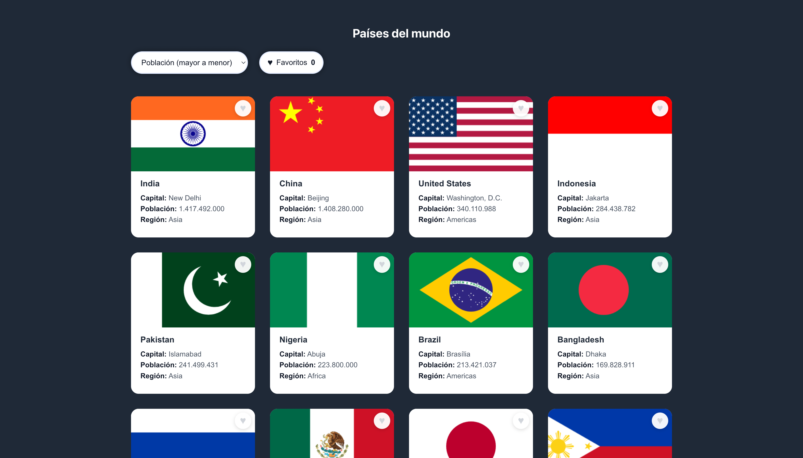
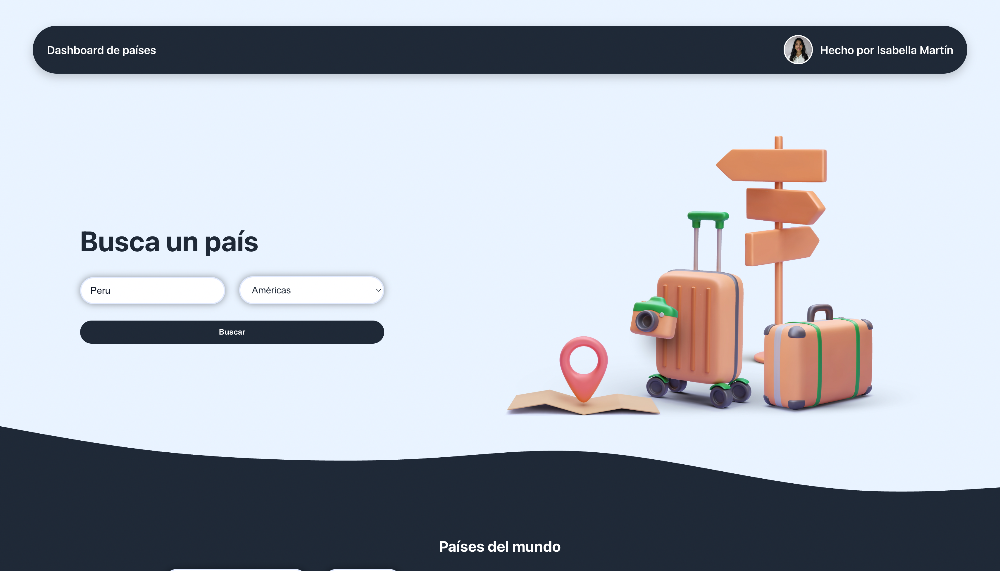
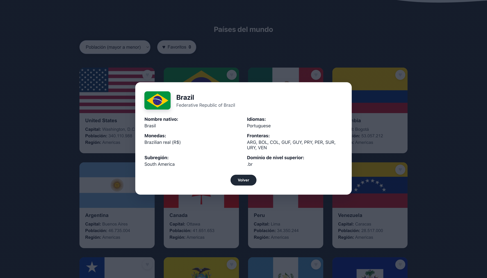

# Dashboard de Países

Dashboard interactivo para explorar países usando la API de REST Countries. Incluye búsqueda, filtros por región, ordenamiento por población, vista detallada y un sistema de favoritos con persistencia en localStorage.

---

## Información del Candidato

- **Nombre:** Isabella Martín
- **Email:** iimartin@espol.edu.ec
- **Fecha:** 18 de febrero de 2026

---

## Enlaces del Proyecto

| Tipo de Enlace | URL |
|----------------|-----|
| Repositorio de GitHub | https://github.com/isabellaim/countries-dashboard |
| Video de Loom | [pendiente] |
| Demo en Vivo (Vercel) | https://countries-dashboard-blue.vercel.app/ |

---

## Instrucciones de Configuración

```bash
# Clonar el repositorio
git clone https://github.com/isabellaim/countries-dashboard.git
cd countries-dashboard

# Instalar dependencias
npm install

# Ejecutar el servidor de desarrollo
npm run dev

# Abrir en el navegador
# http://localhost:5173
```

---

## Tecnologías Utilizadas

- React 19.2
- Vite 7.3
- TypeScript 5.9
- CSS puro
- REST Countries API v3.1

---

## Características Implementadas

### Características Principales

| Característica | Estado | Notas |
|----------------|--------|-------|
| Lista de Países | ✅ | Consumo de REST Countries con campos optimizados |
| Funcionalidad de Búsqueda | ✅ | Búsqueda por nombre común u oficial |
| Filtro por Región | ✅ | África, Américas, Asia, Europa, Oceanía |
| Vista Detallada del País | ✅ | Modal con datos adicionales |
| Estados de Carga | ✅ | Mensajes claros de loading |
| Manejo de Errores | ✅ | Mensaje de error al fallar la API |

### Características Extra

| Característica | Estado | Notas |
|----------------|--------|-------|
| Diseño Responsivo | ✅ | Adaptado a móvil, tablet y desktop |
| Modo Oscuro/Claro | ❌ | No implementado |
| Funcionalidad de Ordenamiento | ✅ | Orden por población en tiempo real |
| Favoritos (localStorage) | ✅ | Guardado persistente |
| TypeScript | ✅ | Migración completa a TSX |
| Pruebas Unitarias | ❌ | No implementado |
| Despliegue en Vivo | ✅  | En Vercel |

---

## Capturas de Pantalla

Guarda tus imágenes en una carpeta llamada `screenshots/` en la raíz del proyecto y referencia así:

```

```

Si no tienes imágenes todavía, puedes dejar los archivos vacíos o tomar capturas desde la demo en vivo.

### Página Principal / Lista de Países

> Descripción: Vista principal con el grid de países, tarjetas con bandera, nombre y datos básicos.

### Búsqueda en Acción
(./screenshots/search2.png)
> Descripción: Resultado de la búsqueda por nombre con filtros aplicados desde el buscador.

### Vista Detallada del País

> Descripción: Modal con información extendida del país (idiomas, monedas, fronteras, subregión, TLD).

### Estados de Carga / Error

> Descripción: Mensajes de carga y manejo de error cuando la API demora o falla.

---

## Estructura del Proyecto

```
src/
├── assets/
├── components/
│   ├── CountryCard.tsx
│   ├── CountryDetail.tsx
│   ├── CountryList.tsx
│   ├── FavoriteButton.tsx
│   ├── FavoritesToggle.tsx
│   ├── Header.tsx
│   ├── Hero.tsx
│   ├── SearchBar.tsx
│   ├── SortFilter.tsx
│   └── Wave.tsx
├── hooks/
│   ├── useCountries.ts
│   └── useFavorites.ts
├── services/
│   └── countryService.ts
├── types/
│   └── country.ts
├── App.tsx
└── main.tsx
```

---

## Desafíos Enfrentados

### Desafío 1: Campos limitados en la API
**Problema:** La API devolvía respuestas vacías al usar demasiados campos.

**Solución:** Usé el parámetro `fields` con el máximo permitido y ajusté los tipos en TypeScript.

### Desafío 2: Composición de filtros y ordenamiento
**Problema:** Combinar búsqueda + región + favoritos sin perder rendimiento ni consistencia.

**Solución:** Centralicé la lógica de filtrado en CountryList y apliqué el ordenamiento al final.

---

## Lo Que Aprendí

- Organizar el consumo de API con servicios tipados.
- Manejar estados derivados (filtros + ordenamiento) con efectos controlados.
- Persistir favoritos en localStorage sin romper la UX.

---

## Si Tuviera Más Tiempo

- [ ] Añadir pruebas unitarias con Vitest y Testing Library.
- [ ] Agregar toggle y funcionalidad de modo oscuro/claro.

---

## Auto-Evaluación

| Área | Calificación (1-5) | Comentarios |
|------|-------------------|-------------|
| Funcionalidad | 5 | Todas las features solicitadas están completas |
| Calidad del Código | 5 | Código organizado por componentes y hooks |
| UI/UX | 5 | Diseño consistente y responsive |
| Documentación | 5 | README completo, faltan enlaces/capturas |

---